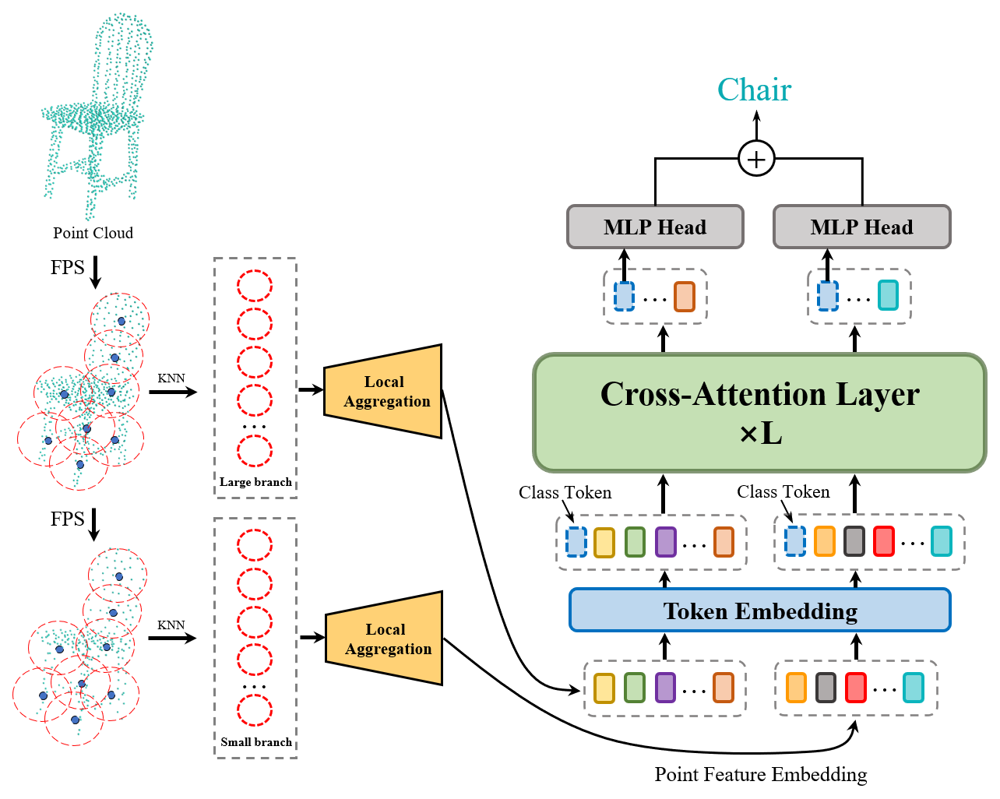
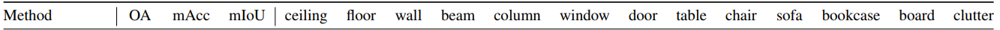
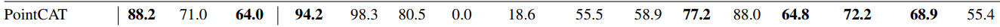

# Pytorch Implementation of PointCAT
This is the original PyTorch implementation of PointCAT: Cross-Attention Transformer for point cloud.

Paper link: https://arxiv.org/pdf/2304.03012.pdf.

## Install

The latest codes are tested on Windows 10,  CUDA11.3,  PyTorch 1.11.0 and Python 3.9:
```shell
conda install pytorch==1.11.0 torchvision==0.12.0 torchaudio==0.11.0 cudatoolkit=11.3 -c pytorch
```

pointnet2_ops_lib:

```shell
pip install pointnet2_ops_lib/.
```

## Requirement
```
einops==0.6.0
h5py==3.6.0
matplotlib==3.5.2
numpy==1.21.5
open3d==0.15.1
pandas==1.4.2
pointnet2_ops==3.0.0
pyntcloud==0.3.1
scikit_learn==1.2.2
scipy==1.8.0
thop==0.1.1.post2209072238
timm==0.6.7
tqdm==4.64.0
```
##  architecture for Shape Classification



## Classification (ModelNet40)

## Data Preparation

Download  **ModelNet**40 dataset [here](https://shapenet.cs.stanford.edu/media/modelnet40_ply_hdf5_2048.zip) and save in `classification_ModelNet40\utils\data`.

## Train & Test

```shell
# Classification on ModelNet40
cd ./classification_ModelNet40

# Train
python train.py --batch_size 16 --use_sgd --learning_rate 0.01

# Test
python test.py --batch_size 16 --checkpoint your_chekpoint_root  
```

## Paper Result

Download our best model in google drive [here](https://drive.google.com/drive/folders/1-hEw1u013bDSke3bgYShw-R6R9DgpnXq) and save in ./classification_ModenNet40/checkpoints/best_checkpoints.

```shell
python test.py --checkpoint checkpoints/best_checkpoints ## Test result: 93.5% OA & 90.9% mAcc
```

## Performance

| Model | Inputs | Over All Accuracy (%) | Mean Accuracy (%) | Vote |
|:-:|:-:|:-:|:-:|:-:|
| PointCAT | 1024 points |         93.5%         | 90.9% | × |

## Part Segmentation (ShapeNet)

## Data Preparation

Download alignment **ShapeNetPart** [here](https://shapenet.cs.stanford.edu/media/shapenetcore_partanno_segmentation_benchmark_v0_normal.zip)  and save in `part_segmentation/data/shapenetcore_partanno_segmentation_benchmark_v0_normal/`.

## Run

```shell
# Part Segmentation on ShapeNetPart
cd ./part_segmentation

# Train
python train.py --exp_name "your_exp_name" --lr 0.003 --batch_size 16 --epochs 250

# Test
python train.py --exp_name "your_exp_name" --eval
```
## Performance

| Cls. mIoU | Inst. mIoU |    aero    | bag | cap | car | chair | earphone | guitar |
|:-:|:-:|:-:|:-:|:-:|:-:|:-:|:-:|:-:|
|84.4	|86.0|83.0	|83.8	|90.1	|79.8	|90.2	|83.4	|91.8	|
| **knife** |  **lamp**  | **laptop** | **motorbike** | **mug** | **pistol** | **rocket** | **skateboard** | **table** |
|   87.8    |    82.5    |    95.9    |     76.1      |  95.4   |    84.9    |    68.5    |      83.1      |   84.3    |

## Visualization

```shell
# Visualization of Part Segmentation Results
cd ./part_segmentation

img_root = './data/shapenetcore_partanno_segmentation_benchmark_v0_normal'
model_root = './checkpoints/your_experiment_root'  # dir to your checkpoints
target_root = './results/your_result_root'  # dir to save the result

# Visualization
python vis.py  # 
```


## Semantic Segmentation (S3DIS)

## Data Preparation
Download 3D indoor parsing dataset (**S3DIS**) [here](http://buildingparser.stanford.edu/dataset.html)  and save in `data/s3dis/Stanford3dDataset_v1.2_Aligned_Version/`.
```
cd data_utils
python collect_indoor3d_data.py
```
Processed data will save in `data/stanford_indoor3d/`. The data structure be like:

```
├─stanford_indoor3d
|         ├─Area_1_conferenceRoom_1.npy
|         ├─Area_1_conferenceRoom_2.npy
|         ├─Area_1_copyRoom_1.npy
|         ├─Area_1_hallway_1.npy
|         ├─Area_1_hallway_2.npy
|         ├─Area_1_hallway_3.npy
		  ...............
```

## Run

```shell
# Semantic Segmentation on S3DIS
cd ./seg_segmentation

# Train
python train.py --learning_rate 0.001 --optimizer AdamW  --test_area 5 

# Test
python test_semseg.py --log_dir your_expriment_root --visiual --test_area 5
```
## Visualization

Visualization results will save in `log/sem_seg/your_expriment_root/visual/` and you can transform these .obj files to .txt by these command:

```shell
cd ./seg_segmentation/data

# Vis
python input_vis.py
```


## Performance





## Reference By

[charlesq34/PointNet++](https://github.com/charlesq34/pointnet2)

## Citation
If you find this repo useful in your research, please consider citing it and our other works:
```
@article{Pytorch_Pointnet_Pointnet2,
      Author = {Xu Yan},
      Title = {Pointnet/Pointnet++ Pytorch},
      Journal = {https://github.com/yanx27/Pointnet_Pointnet2_pytorch},
      Year = {2019}
}

@misc{guo2020pct,
      title={PCT: Point Cloud Transformer}, 
      author={Meng-Hao Guo and Jun-Xiong Cai and Zheng-Ning Liu and Tai-Jiang Mu and Ralph R. Martin and Shi-Min Hu},
      year={2020},
      eprint={2012.09688},
      archivePrefix={arXiv},
      primaryClass={cs.CV}
}

@misc{yang2023pointcat,
      title={PointCAT: Cross-Attention Transformer for point cloud}, 
      author={Xincheng Yang and Mingze Jin and Weiji He and Qian Chen},
      year={2023},
      eprint={2304.03012},
      archivePrefix={arXiv},
      primaryClass={cs.CV}
}
```
## Selected Projects using This Codebase
[PCT: Point Cloud Transformer](https://github.com/MenghaoGuo/PCT)

[Pytorch_Pointnet_Pointnet2](https://github.com/yanx27/Pointnet_Pointnet2_pytorch)
